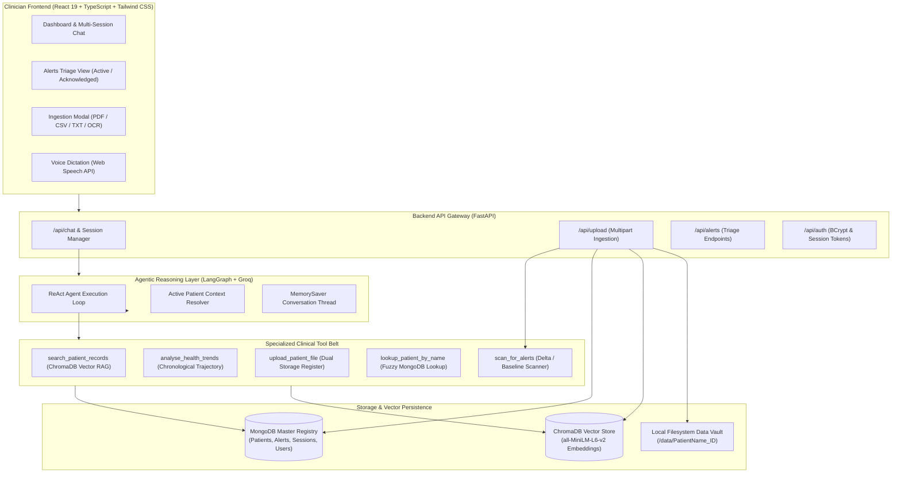

# 🏥 MedNexus AI: AI-Powered Clinical Intelligence & Decision Support Platform

[](https://www.python.org/)
[](https://fastapi.tiangolo.com/)
[](https://react.dev/)
[](https://www.typescriptlang.org/)
[](https://vitejs.dev/)
[](https://tailwindcss.com/)
[](https://www.langchain.com/)
[](https://langchain-ai.github.io/langgraph/)
[](https://www.trychroma.com/)
[](https://www.mongodb.com/)
[](https://groq.com/)

---

## 📌 Executive Overview

**MedNexus AI** is a clinical intelligence and decision support platform engineered to assist physicians, hospital triage teams, and clinical researchers in navigating complex, multimodal patient histories. 

Modern clinical environments struggle with **data fragmentation**: patient data is scattered across scanned PDF lab reports, handwritten or digital prescriptions, unstructured consultation notes, vital sign CSV trend logs, and diagnostic scans. When time is critical, identifying subtle physiological deterioration (such as developing sepsis, acute kidney injury delta, or hypertensive spikes) becomes cognitive burden for medical practitioners.

**MedNexus AI solves this bottleneck** through an autonomous **ReAct clinical agent architecture (LangGraph)**, a dual-database storage paradigm (MongoDB + ChromaDB), and a proactive post-ingestion clinical anomaly scanner. MedNexus extracts, parses, embeds, and analyzes multimodal medical data, providing clinicians with:

1. **Instant Evidence-Based QA** grounded strictly in retrieved patient records with zero hallucination.
2. **Deterministic Active Patient Context Management** that tracks pronouns and references across consultation turns without asking the clinician to repeat patient IDs.
3. **Automated Delta & Baseline Risk Triage** that compares incoming diagnostic findings against prior visits to flag critical trajectory changes.
4. **Longitudinal Trajectory Analysis** detailing baseline vitals, chronological progression, deterioration assessments, and protocol recommendations.
5. **Modern, Clinician-First Dashboard** with voice dictation, authentication, multi-session consultations, and an interactive alerts triage suite.

---

## 📑 Table of Contents

- [Key Architecture & Capabilities](#-key-architecture--capabilities)
- [System Architecture Diagram](#-system-architecture-diagram)
- [Core Features & Tool Belt](#-core-features--tool-belt)
- [Multimodal Ingestion Pipeline](#-multimodal-ingestion-pipeline)
- [RAGAS Evaluation Framework](#-ragas-evaluation-framework)
- [Project Directory Structure](#-project-directory-structure)
- [Getting Started & Installation](#-getting-started--installation)
  - [Prerequisites](#prerequisites)
  - [1. Clone Repository](#1-clone-repository)
  - [2. Environment Configuration](#2-environment-configuration)
  - [3. Backend Installation & Setup](#3-backend-installation--setup)
  - [4. Database Initialization & Sync](#4-database-initialization--sync)
  - [5. Frontend Installation & Launch](#5-frontend-installation--launch)
- [Running RAGAS Evaluation](#-running-ragas-evaluation)
- [REST API Endpoints](#-rest-api-endpoints)
- [Clinical Safety, Privacy & Compliance Disclaimer](#-clinical-safety-privacy--compliance-disclaimer)

---

## 🚀 Key Architecture & Capabilities

### 1. Autonomous ReAct Clinical Agent (LangGraph + ChatGroq)
- Orchestrated via `create_react_agent` powered by ultra-low-latency Groq inference (`openai/gpt-oss-120b`).
- **MemorySaver Thread Persistence**: Keeps track of multi-turn conversational history while persisting every message into MongoDB.
- **State-Based Active Patient Context Manager**: Automatically parses user inputs against the hospital patient registry. If a clinician switches from *"Show me Rohan Sharma's vitals"* to *"What did his last blood test say?"* or *"Summarize his prescription"*, the agent deterministically maintains Rohan's context (`AMH-2026-04581`) without re-prompting.
- **Strict Clinical Formatting Guardrails**: Formats diagnostic findings, laboratory panels, medications, and advice in structured bullet points, reserving Markdown tables exclusively for chronological numerical vitals.

### 2. Dual Database Ingestion Paradigm
- **ChromaDB (Vector Database)**: Persistent vector collection storing segmented document chunks embedded with `sentence-transformers/all-MiniLM-L6-v2`. Each vector is tagged with patient metadata (`patient_id`, `file_name`) for isolated retrieval.
- **MongoDB (Operational Document Store)**: Manages clinician authentication, master patient rosters, active chat sessions, and risk alerts. Equipped with a **10-day TTL index** on acknowledged alerts for automated database sanitation.

### 3. Proactive Post-Ingestion Alert Scanner
- When any medical file is uploaded, the system triggers `scan_for_alerts` in the background.
- Employs **Delta Comparison** (comparing new reports against historical files) or **Baseline Anomaly Scanning** (for initial checkups).
- Evaluates clinical risk markers:
  - 🩸 **Hypertension**: BP > 140/90 mmHg or acute surges.
  - 🍬 **Glycemic Dysregulation**: HbA1c > 7.5% or acute glucose instability.
  - 🫀 **Cardiovascular / Sepsis / Renal Markers**: Elevated creatinine, abnormal troponin, septic vitals.
- Generates structured risk scores (1–100) and severity ratings (`high`, `medium`, `low`) directly into the Triage Dashboard.

### 4. Multimodal Document Parsing & OCR
- **PDF Reports**: Ingested and parsed with `PyPDFLoader`.
- **Longitudinal Trend CSVs**: Tabular vitals parsed and formatted via `pandas`.
- **Consultation Notes (TXT)**: Clinical notes indexed with UTF-8 character preservation.
- **Medical Images & Scans (PNG/JPG)**: Extracted via PyTorch-powered `EasyOCR` with lazy-loading to optimize server cold start.

---

## 🏗️ System Architecture Diagram



---

## 🛠️ Core Features & Tool Belt

| Tool Name | Engine / Target | Clinical Purpose |
| :--- | :--- | :--- |
| `search_patient_records` | ChromaDB + SentenceTransformers | Performs semantic search on vectorized clinical notes, discharge summaries, and prescriptions, filtered strictly by target `patient_id`. |
| `analyse_health_trends` | RAG Chain + ChromaDB | Chronologically orders multi-date vitals and lab panels to evaluate whether a patient is stabilizing or deteriorating over time. |
| `lookup_patient_by_name` | MongoDB Master Registry | Resolves colloquial patient names (e.g., *"Amit"*, *"Rohan"*) to their standardized hospital identifier (e.g., `AMH-2026-06118`). |
| `upload_patient_file` | MongoDB + Filesystem + ChromaDB | Coordinates dual-database ingestion, generating persistent vectors and updating demographic records. |
| `scan_for_alerts` | LLM + Clinical Rules | Evaluates post-upload chunks for delta shifts or critical baseline deviations, generating structured alert cards in the triage view. |

---

## 🔬 Multimodal Ingestion Pipeline

```
Patient File Upload (PDF, CSV, TXT, PNG/JPG)
         │
         ▼
[Format Detection & Extraction]
  ├── PDF   ➔ PyPDFLoader
  ├── CSV   ➔ Pandas Tabular Formatter
  ├── TXT   ➔ Standard UTF-8 Stream Loader
  └── Image ➔ EasyOCR (PyTorch-based English Optical Recognition)
         │
         ▼
[Standardized Patient Identification]
  - Resolves Hospital ID (e.g., AMH-2026-XXXXX)
  - Creates/Updates MongoDB Profile & File Index
         │
         ▼
[Text Chunking & Semantic Vectorization]
  - RecursiveCharacterTextSplitter (Chunk Size: 500 chars, Overlap: 100 chars)
  - Dense Vectorization via all-MiniLM-L6-v2 (384-dimensional space)
  - ChromaDB Collection Ingestion with Patient ID Metadata Isolation
         │
         ▼
[Automated Risk Scanner]
  - Performs Delta Analysis (compared to previous reports) or Baseline Check
  - Emits Structured Risk Card to MongoDB Alerts Triage
```

---

## 📊 RAGAS Evaluation Framework

To ensure that MedNexus AI meets clinical standards of truthfulness and accuracy, the repository includes an automated evaluation pipeline (`genai/evaluate.py`) utilizing **RAGAS** (Retrieval Augmented Generation Assessment).

### Key Metrics Evaluated:
1. **Faithfulness**: Quantifies whether every factual claim in the generated medical summary is directly grounded in retrieved document chunks (anti-hallucination metric).
2. **Answer Relevancy**: Assesses how accurately the AI response addresses the clinician's diagnostic inquiry without superfluous noise.
3. **Context Recall**: Verifies whether all ground-truth reference data from patient clinical records was successfully captured in the vector search step.

> **Zero Vendor Lock-in**: The evaluation suite runs using **LangChainLLMWrapper (ChatGroq Llama-3.3-70B)** and **local HuggingFace embeddings**, eliminating dependencies on external proprietary API quotas for testing.

---

## 📂 Project Directory Structure

```plaintext
MedNexusAI/
├── backend/
│   ├── app.py                   # FastAPI application, REST endpoints, and file upload router
│   ├── auth.py                  # BCrypt password hashing & session token authentication
│   ├── database.py              # MongoDB operational store (Patients, Alerts, Sessions, Users)
│   └── sync_mongo.py            # Bootstrap utility to synchronize filesystem files with MongoDB
│
├── genai/
│   ├── agent.py                 # LangGraph ReAct agent & active patient context manager
│   ├── tools.py                 # Clinical tool belt (Vector search, trend analyzer, risk scanner)
│   ├── rag_ingestion.py         # Multimodal document loaders (PDF, CSV, TXT, EasyOCR)
│   ├── chunk.py                 # Recursive character text splitting configuration
│   ├── vector_store.py          # ChromaDB persistence & vector indexing pipeline
│   ├── retriever.py             # Semantic retriever with patient_id metadata filtering
│   ├── generate.py              # Prompt templates & Groq RAG chain generator
│   ├── evaluate.py              # RAGAS quantitative evaluation benchmark suite
│   ├── main_pipeline.py         # Batch ingestion script for initial dataset indexing
│   └── chroma_db/               # Persistent ChromaDB vector database files
│
├── frontend/
│   ├── public/                  # Static assets and icons
│   ├── src/
│   │   ├── components/
│   │   │   ├── Dashboard.tsx            # Main consultation chat interface & voice dictation
│   │   │   ├── AlertsTriageView.tsx     # Filterable clinical triage alerts dashboard
│   │   │   ├── AlertSummaryModal.tsx    # Modal inspector for detailed risk findings
│   │   │   ├── IngestionModal.tsx       # Document upload & Patient ID validation modal
│   │   │   ├── Sidebar.tsx              # Navigation, patient roster & consultation threads
│   │   │   ├── Login.tsx                # Clinician login portal
│   │   │   └── Signup.tsx               # Clinician registration with badge & specialty
│   │   ├── App.tsx                      # Main application orchestrator & state manager
│   │   ├── Profile.tsx                  # Clinician account profile view
│   │   ├── types.ts                     # TypeScript interfaces and shared types
│   │   └── index.css                    # Tailwind CSS v4 styling rules
│   ├── package.json             # Frontend dependencies & scripts
│   └── vite.config.ts           # Vite configuration
│
├── data/                        # Real-world clinical patient dataset cohorts
│   ├── Aarav_Mehta_AMH-2026-09437/      # Pediatrics (Blood reports, growth CSV, notes)
│   ├── Amit_Patel_AMH-2026-06118/       # Cardiology (ECG, BP trends, cardiac notes)
│   ├── Anita_Yadav_AMH-2026-07432/      # Oncology / Neurology (Brain tumor pathology)
│   ├── Meera_Joshi_AMH-2026-10561/      # Infectious Disease (Fever monitoring, antibiotic Rx)
│   ├── Neha_Verma_AMH-2026-05294/       # Endocrinology (Glucose history, diabetes reports)
│   ├── Raj_Malhotra_AMH-2026-07142/     # Nephrology (CKD staging, creatinine trends)
│   ├── Ritik_Jaiswal_AMH-2026-18472/    # Critical Care (Septic shock ICU report)
│   ├── Rohan_Sharma_AMH-2026-04581/     # Hypertension (BP logs, prescription images)
│   └── Sara_Khan_AMH-2026-08215/        # Preventive Medicine (Vitamin D, normal vitals)
│
├── .env.example                 # Environment configuration template
├── .gitignore                   # Ignored files (virtualenvs, secrets, cache, temp uploads)
├── pyproject.toml               # Python project configuration & dependencies
├── requirements.txt             # Pip dependency specification
└── README.md                    # Project documentation
```

---

## ⚡ Getting Started & Installation

### Prerequisites
- **Python**: Version `3.11` or higher
- **Node.js**: Version `18.x` or higher (with npm)
- **MongoDB**: A running instance (local MongoDB server or [MongoDB Atlas](https://www.mongodb.com/cloud/atlas))
- **Groq API Key**: Obtain a free high-speed API key from [Groq Console](https://console.groq.com/)

---

### 1. Clone Repository

```bash
git clone https://github.com/Aditee-18/MedNexus-AI-Powered-Clinical-Intelligence-Platform.git
cd MedNexus-AI-Powered-Clinical-Intelligence-Platform
```

---

### 2. Environment Configuration

Create a `.env` file in the root directory by copying the provided example:

```bash
cp .env.example .env
```

Edit `.env` with your actual credentials:

```ini
# Groq API Key for Clinical LLM Reasoning & Agentic Execution
GROQ_API_KEY=gsk_your_actual_groq_api_key_here

# MongoDB Connection String (Atlas or Local)
MONGO_URI=mongodb+srv://<username>:<password>@cluster.mongodb.net/mednexus_db?retryWrites=true&w=majority
# OR for local instances:
# MONGO_URI=mongodb://localhost:27017/mednexus_db
```

---

### 3. Backend Installation & Setup

Set up a Python virtual environment and install backend dependencies:

```bash
# Create and activate a virtual environment
python -m venv .venv

# On Windows (PowerShell):
.venv\Scripts\Activate.ps1
# On Linux / macOS:
source .venv/bin/activate

# Install dependencies using pip or uv
pip install -r requirements.txt
```

---

### 4. Database Initialization & Sync

Before launching the server, initialize the patient roster and vector database:

```bash
# Step 4a: Sync local patient dataset folders into MongoDB
python backend/sync_mongo.py

# Step 4b: (Optional) Index or re-index existing files into ChromaDB
python genai/main_pipeline.py
```

Launch the FastAPI backend server:

```bash
uvicorn backend.app:app --host 0.0.0.0 --port 8000 --reload
```

The API will be available at: `http://localhost:8000`  
Interactive Swagger Docs: `http://localhost:8000/docs`

---

### 5. Frontend Installation & Launch

Open a separate terminal window for the frontend:

```bash
cd frontend

# Install Node dependencies
npm install

# Start Vite development server
npm run dev
```

The MedNexus AI Clinician Dashboard will launch at: `http://localhost:5173`

---

## 📈 Running RAGAS Evaluation

To run quantitative benchmarks testing retrieval accuracy, factual faithfulness, and answer relevancy:

```bash
python genai/evaluate.py
```

The script will:
1. Load realistic clinical test cases across different patient cohorts.
2. Query ChromaDB and generate responses via the Groq RAG chain.
3. Calculate **Faithfulness**, **Answer Relevancy**, and **Context Recall** metrics.
4. Output a detailed Pandas scorecard table in your terminal.

---

## 🔌 REST API Endpoints

| Method | Endpoint | Description |
| :--- | :--- | :--- |
| `POST` | `/api/auth/signup` | Registers a clinician profile with hospital badge ID and medical specialty. |
| `POST` | `/api/auth/login` | Authenticates clinician credentials and issues a session token. |
| `GET` | `/api/patients` | Fetches the master list of registered patients and demographic baselines. |
| `GET` | `/api/alerts` | Retrieves active and acknowledged clinical risk alerts. |
| `POST` | `/api/alerts/{id}/acknowledge` | Marks a clinical alert as acknowledged (activates 10-day TTL index). |
| `DELETE` | `/api/alerts/{id}` | Deletes an individual alert record. |
| `POST` | `/api/alerts/clear` | Empties the triage alerts collection. |
| `GET` | `/api/chat/sessions` | Lists previous consultation threads for the logged-in clinician. |
| `GET` | `/api/chat/history/{session_id}` | Retrieves persistent message history for a specific consultation thread. |
| `POST` | `/api/chat` | Main ReAct agent chat endpoint; accepts clinical query and manages active context. |
| `POST` | `/api/upload` | Multipart endpoint that ingests PDF, CSV, TXT, or Image files, updates ChromaDB, and triggers automated risk scans. |

---

## 🛡️ Clinical Safety, Privacy & Compliance Disclaimer

> **DISCLAIMER**: MedNexus AI is an advanced Clinical Decision Support (CDS) research system designed exclusively to assist licensed healthcare providers in organizing and analyzing clinical data. It is **not** a replacement for professional clinical judgment, diagnostic evaluations, or medical decision-making. 
> 
> All patient records included in the `data/` directory are synthetic or anonymized benchmark cases used strictly for development, demonstration, and evaluation purposes. In a production healthcare setting, deploy this platform in accordance with applicable HIPAA, GDPR, and regional health data privacy regulations.

---

## 🤝 Contributing

Contributions to MedNexus AI are welcome! Please follow these steps:
1. Fork the repository.
2. Create a feature branch: `git checkout -b feature/clinical-enhancement`.
3. Commit your changes: `git commit -m "feat: Add new clinical capability"`.
4. Push to the branch: `git push origin feature/clinical-enhancement`.
5. Open a Pull Request.

---

## 📄 License

This project is licensed under the [MIT License](LICENSE).